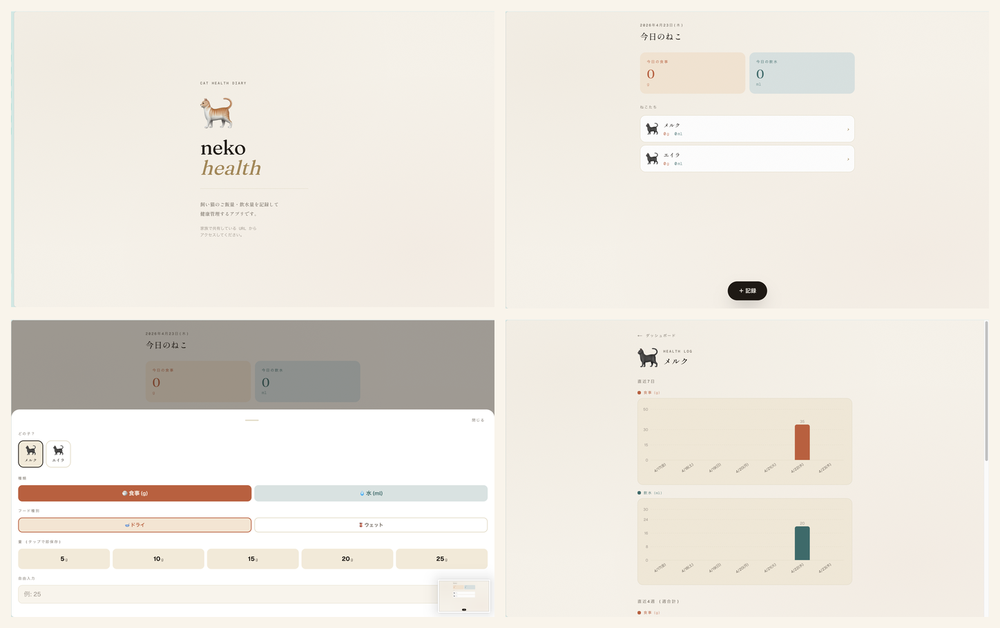

# neko-health


妻と飼い猫2匹（メルク・エイラ）のご飯・飲水量を3タップで記録する個人 Web アプリ。現在運用中。



## 設計上の判断

**認証なし・秘密 URL 方式**
個人2人用途で JWT/OAuth はオーバーエンジニアリング。nanoid(24) の推測不可能な URL をパスに埋め込み、家族外アクセスをブロックする。実装コストを最小化しながら十分なセキュリティを確保。

**3タップ制約を最優先**
「スマホから3タップ以内で1回の記録が完了する」を設計の起点に置き、UI・データモデル・UX をそこから逆算した。ボトムシートを閉じない設計（連続記録のため）もこの制約から導出。

**Edge Runtime でコールドスタートを排除**
Node.js サーバーレス関数のコールドスタート（1〜3秒）がスマホ利用時のストレスになっていたため、Edge Runtime（≈0ms）に移行。supabase-js が Web 標準 API のみで動作するため移行は無停止で完了。

**RLS 無効・アプリ層で認可を一元化**
secret ベースの RLS を書くと DB とアプリ層で認可ロジックが分散する。`assertHousehold()` に集約し、全 Server Action の冒頭で呼ぶことで一貫性を担保。

**0円運用**
Supabase Free + Vercel Hobby の範囲内で設計。生涯レコード数の試算は ~20MB で Free 枠に収まることを確認済み。

## 技術スタック

- **Frontend**: Next.js 16 (App Router, Edge Runtime) + Tailwind CSS v4
- **DB**: Supabase (PostgreSQL)
- **Hosting**: Vercel (Hobby)
- **フォント**: Fraunces / Shippori Mincho / Geist

## セットアップ

### 1. Supabase プロジェクト作成

1. https://supabase.com で新規プロジェクトを作る
2. SQL Editor で `supabase/schema.sql` を実行
3. `supabase/seed.sql` の `REPLACE_WITH_NANOID_24` を以下で生成した値に置換してから実行

```bash
node -e "console.log(require('nanoid').nanoid(24))"
```

4. `seed.sql` の `insert into cats` を自分の猫の数だけ書き換えて実行

### 2. 環境変数

`.env.local` をリポジトリ直下に作成（コミット禁止）:

```
NEXT_PUBLIC_SUPABASE_URL=https://YOUR-PROJECT.supabase.co
SUPABASE_SERVICE_ROLE_KEY=eyJ...   # Settings → API → service_role
```

### 3. 起動

```bash
npm run dev
```

`http://localhost:3000/h/<secret_slug>` を開く。

## デプロイ (Vercel)

```bash
# 環境変数を追加
npx vercel env add NEXT_PUBLIC_SUPABASE_URL production
npx vercel env add NEXT_PUBLIC_SUPABASE_URL preview
npx vercel env add SUPABASE_SERVICE_ROLE_KEY production
npx vercel env add SUPABASE_SERVICE_ROLE_KEY preview

# 本番デプロイ
npx vercel --prod
```

家族には `https://<your-app>.vercel.app/h/<secret_slug>` を共有する。
